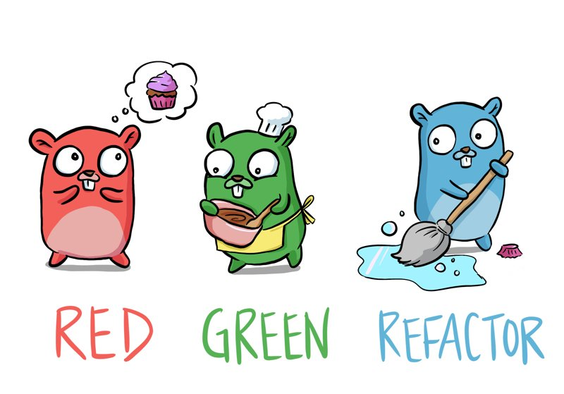

# Writing Testable (and Flexible) Code

## Why is Unit Testing important?

### Quality of Code

Unit testing enhances the quality of the code. It allows developers to verify all the defects that are present in the units before deployment. It also exposes even the smallest edge cases and makes you write better code with confidence. 

Furthermore, when you test your code, sometimes it forces you to think differently while performing individual testing. This can lead to better design ideas. It is similar to the proofreading process that let you enhance your code style. 

### Agile Process

Unit testing makes your coding process more agile. Whenever you add new features to your software, you may need to change some of the codes already tested through unit testing. This can be costly and risky. But if you have the tests in place, you can refactor code confidently. 

### Early Bug Detection

Catching bugs before the integration process is always beneficial and time-saving. Since developers write codes for unit testing, issues can be found early, which can be further resolved by the developer in the early stages. This will save time, and the quality of the code will improve. 

### Proper Documentation

A developer understands the basic unit’s interface and how to use the testing programs to check individual parts of the code. This way, a developer can also learn every functionality of the unit code and ensure that the software behaves as expected.

### Low Costs
unit testing costs you less.

## TDD--The Art of Fearless Programming

## Separation of Concerns
[soc](soc.md)

## Example Task 
[task](task.md)

## References 

* Test Driven Development: By Example (Kent Beck)
* [TestDrivenDevelopment : Martin Fowler](https://martinfowler.com/bliki/TestDrivenDevelopment.html)
